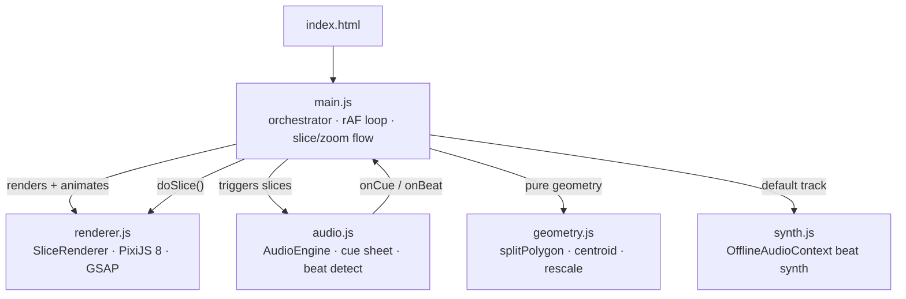

# Polygon Beat Slicer


**Audio-reactive polygon slicer — kinetic editorial animation that fragments shapes in sync with a beat, then zooms into the colored shard to start the cut all over again.**

Polygon Beat Slicer is a zero-dependency-setup browser instrument: a single polygon sits on a warm paper-toned canvas, and every beat drives a blade through it. The blade doesn't just cut the main shape — it slices *every* fragment on screen at once, so the canvas builds into a living composition of drifting shards. After four cuts the camera pushes into the one colored piece, rescales it to fill the frame, and the whole loop restarts from there. A built-in synth generates a default 130 BPM track, so it works the moment you open it — drop in your own audio to slice to anything else.

**Live demo:** [kinetic-animation.pages.dev](https://kinetic-animation.pages.dev)

## ✨ Features

- **Two trigger modes** — *Beat Detection* fires on bass energy (Web Audio FFT, bins 0–12 ≈ 0–1 kHz) with an adjustable threshold and 200 ms cooldown; *Cue Sheet* fires on a fixed grid of 64 beats at 130 BPM.
- **Built-in synth** — a ~30 s electronic beat (kick, snare, hi-hat, filtered bass, pad stabs) rendered offline via `OfflineAudioContext` and loaded automatically. No file required to start.
- **Bring your own audio** — drag any audio file onto the drop zone; it's decoded through the Web Audio API and sliced the same way.
- **Slash-everything cutting** — each blade cuts through *all* fragments on screen simultaneously. The bigger half stays, the smaller half drifts perpendicular to the blade and fades.
- **Recursive zoom loop** — every four cuts the camera zooms into the single colored shard, rescales it to fill the canvas, and clears the rest — the shard becomes the new polygon.
- **Rainbow blade cycle** — each cut lands in the next color of a seven-step spectrum (violet → indigo → blue → green → yellow → orange → red); only one piece is colored at a time.
- **Living physics** — fragments repel each other each frame (spring-back + friction), wobble elastically on impact, and the stage gives a subtle shake on every hit.
- **Paper aesthetic** — warm off-white background (`#f5f0e8`), grey strokes, evenly spaced edge dots, translucent fills, Space Grotesk type, glassmorphism control bar.

## 📦 Installation

Prerequisites: a modern browser (Chromium, Firefox, or Safari with Web Audio API support) and **Node.js 18+** for the dev toolchain.

```bash
git clone https://github.com/bhoot1234567890/kinetic-animation.git
cd kinetic-animation
npm install
```

## 🚀 Usage

Start the Vite dev server:

```bash
npm run dev
```

Open the printed local URL and press **▶ PLAY**. The built-in synth beat loads on startup, so animation begins immediately.

- **Switch timing** — choose *Beat Detection* or *Cue Sheet* from the dropdown.
- **Tune sensitivity** — drag the *Threshold* slider (60–255, default 180); only visible in Beat Detection mode.
- **Slice your own track** — drag an audio file onto the drop zone (or click to browse).
- **Loop** — toggle **∞ Loop** for seamless playback.
- **Reset** — **↻ RESET** clears the canvas and spawns a fresh polygon.

### Production build

```bash
npm run build      # outputs a static site to dist/
npm run preview    # serve the production build locally
```

The build is fully static (HTML + JS) and deploys to any static host.

## ⚙️ Controls

| Control | Range / Values | Default | Description |
|---|---|---|---|
| Mode | `Beat Detection` \| `Cue Sheet` | `Beat Detection` | What triggers each slice |
| Threshold | 60 – 255 | `180` | Bass-energy level that counts as a beat (Beat Detection only) |
| ∞ Loop | on / off | off | Loop the audio buffer seamlessly |
| Drop zone | any audio file | built-in synth | Source audio to slice |

## 🧱 Architecture

The app is vanilla ES modules — no framework. A single `requestAnimationFrame` loop drives everything.



**Per-frame loop** (`main.js → loop()`): `audio.checkCues()` and `audio.checkBeat()` fire callbacks that call `doSlice()`.

**Slice flow** (`doSlice()`):

1. Generate a random cut line through the polygon centroid; `splitPolygon()` divides it into two pieces (custom line-side + edge-intersection math — no clipping library).
2. The smaller piece becomes the *flying* fragment (drifts away); the bigger piece stays as the main polygon and receives the blade color.
3. `_cutExistingPieces()` runs the *same* blade across every fragment already on screen — bigger halves survive, smaller halves drift and fade.
4. After four cuts, the camera zooms into the colored piece via `animateZoom()`, rescales it to fill the canvas, clears the rest, and the loop restarts.

**Rendering layers** (`renderer.js`): three PixiJS containers stacked on the stage — `shapesContainer` (the main polygon), `piecesContainer` (cut fragments), and `flashContainer` (the blade line + impact dot). Each piece is a `Container` with separate fill and stroke layers, so fills can fade independently of outlines.

| File | Role |
|---|---|
| `src/main.js` | DOM wiring, game loop, slice dispatch, four-cut zoom logic |
| `src/renderer.js` | PixiJS 8 setup, paper-style rendering, slash-everything cutting, GSAP slice/zoom/physics |
| `src/audio.js` | `AudioContext` + `AnalyserNode`, cue sheet, bass beat detection |
| `src/geometry.js` | Pure functions: polygon generation, line split, edge dots, rescale, centroid, area |
| `src/synth.js` | `generateDemoTrack()` — offline-rendered 130 BPM beat |
| `src/style.css` | Warm theme, Space Grotesk, glassmorphism controls |
| `index.html` | Entry point: control bar + canvas, loads `src/main.js` as a module |

## 🤝 Contributing

This is a small, single-purpose project with no test suite, linter, or formatter configured. Fork it, open the dev server, and iterate visually. Pull requests welcome.

## 📄 License

This repository does **not** include a `LICENSE` file. No license is granted; default copyright (all rights reserved) applies until one is added. Add a `LICENSE` file before distributing or reusing the code.
